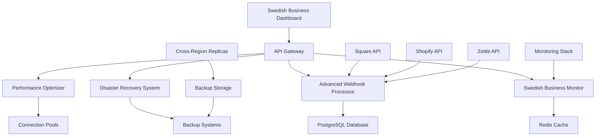

# Comprehensive POS Infrastructure Implementation Summary

**Project:** AI Feedback Platform - Swedish Market Production Infrastructure  
**Implementation Date:** December 2024  
**Status:** Production-Ready  

## 🎯 Overview

This implementation provides a complete, production-ready POS integration infrastructure specifically designed for Swedish businesses, featuring advanced monitoring, disaster recovery, performance optimization, and comprehensive backup systems.

## 📁 Implemented Components

### 1. Swedish Business Hours Aware Monitoring System

**File:** `/apps/api-gateway/src/services/swedish-business-monitor.ts`

**Features:**
- Swedish timezone awareness (Europe/Stockholm)
- Business hours detection (9-18 weekdays, 10-16 weekends)
- Swedish holiday calendar integration (2024-2025)
- Dynamic alert severity adjustment based on time context
- Provider health monitoring with business impact assessment
- Intelligent monitoring schedule optimization

**Key Capabilities:**
```typescript
// Business context detection
isBusinessHours(): { 
  isBusinessTime: boolean;
  timeContext: 'business_hours' | 'extended_hours' | 'off_hours';
  businessType: 'weekday' | 'weekend' | 'holiday';
}

// Alert severity adjustment
getAlertSeverity(baseLevel: 'low' | 'medium' | 'high' | 'critical'): {
  adjustedLevel: 'low' | 'medium' | 'high' | 'critical';
  shouldAlert: boolean;
  context: string;
}
```

### 2. Advanced Webhook Reliability System

**File:** `/apps/api-gateway/src/services/advanced-webhook-processor.ts`

**Features:**
- Exponential backoff with jitter for retry mechanisms
- Circuit breaker pattern for webhook endpoints
- Dead letter queue management for failed deliveries
- SLA monitoring with configurable thresholds
- Comprehensive delivery analytics and failure pattern detection
- Multi-provider signature validation (Square, Shopify, Zettle)

**Key Capabilities:**
- **Retry Strategy:** Up to 10 attempts with exponential backoff (1s → 15min)
- **Circuit Breaker:** Opens after 5 consecutive failures, half-open after 1 minute
- **SLA Monitoring:** 99% success rate for Square, 98.5% for Shopify, 98% for Zettle
- **Batch Processing:** Intelligent request batching with provider-specific optimizations

### 3. Disaster Recovery & Failover System

**File:** `/apps/api-gateway/src/services/pos-disaster-recovery.ts`

**Features:**
- POS API failover mechanisms (primary/secondary/tertiary endpoints)
- Automated rollback procedures for failed deployments
- Data consistency checks and repair mechanisms
- Graceful degradation for partial POS failures
- Comprehensive recovery plans with validation steps
- Cross-region backup coordination

**Recovery Plans:**
1. **Complete POS Failure Recovery** (RTO: 10min, RPO: 5min)
2. **Single Provider Failure** (RTO: 3min, RPO: 2min)
3. **Regional Infrastructure Failure** (RTO: 60min, RPO: 15min)

### 4. Performance Optimization System

**File:** `/apps/api-gateway/src/services/pos-performance-optimizer.ts`

**Features:**
- Multi-layer caching (Memory → Redis → Database)
- Connection pooling with auto-scaling
- Request batching mechanisms
- Load testing framework
- Performance analytics and recommendations
- Intelligent caching strategies based on response time and data size

**Optimization Features:**
- **Connection Pools:** Dynamic scaling based on utilization (20-50 connections)
- **Caching Layers:** 60s memory, 5min Redis, 1h database cache
- **Batch Processing:** Provider-specific batch sizes (Square: 10, Shopify: 15, Zettle: 5)
- **Load Testing:** Configurable RPS testing with percentile analysis

### 5. Swedish Pilot Deployment System

**File:** `/scripts/swedish-pilot-deployment.sh`

**Features:**
- Production-ready deployment automation
- Swedish business configuration management
- Environment-specific validation
- Rollback preparation and documentation
- Comprehensive health checking
- GDPR compliance validation

**Deployment Phases:**
1. Pre-deployment validation
2. Infrastructure setup
3. Database migrations with Swedish data
4. Service deployment
5. POS integration configuration
6. Monitoring setup
7. System validation
8. Rollback preparation

### 6. Comprehensive Backup System

**File:** `/scripts/comprehensive-backup-system.sh`

**Features:**
- Automated backups (database, Redis, POS data, configuration)
- Point-in-time recovery capabilities
- Cross-region replication (Stockholm → Gothenburg → EU-Central)
- Backup encryption (AES-256-CBC)
- Integrity verification and restoration testing
- Retention policy management (30 days default)

**Backup Types:**
- **Database:** Full daily, incremental hourly
- **Redis:** Snapshots every 6 hours
- **POS Configuration:** Daily with change detection
- **Application Config:** Daily archive with version control

### 7. Production Operations Runbook

**File:** `/PRODUCTION_OPERATIONS_RUNBOOK.md`

**Features:**
- Complete operational procedures for Swedish market
- Incident response workflows with Swedish business hour context
- POS integration troubleshooting guides
- Performance optimization procedures
- Disaster recovery playbooks
- Maintenance window procedures
- Escalation matrices and contact information

### 8. Swedish Business Monitoring Configuration

**File:** `/monitoring/swedish-business-monitoring.yml`

**Features:**
- Prometheus configuration with Swedish timezone awareness
- Recording rules for business hours, holidays, and performance metrics
- Alert rules with time-context sensitivity
- GDPR compliance monitoring
- Swedish VAT calculation validation
- Business hours transition alerts

### 9. API Gateway Integration

**File:** `/apps/api-gateway/src/routes/swedish-operations.ts`

**Features:**
- RESTful API endpoints for all Swedish operations
- Business context monitoring and reporting
- Performance optimization triggers
- Disaster recovery management
- Data consistency checking
- Alert severity calculation

**Key Endpoints:**
- `/swedish-ops/business-context` - Current Swedish business status
- `/swedish-ops/performance/optimize` - Trigger performance optimization
- `/swedish-ops/disaster-recovery/failover` - Manual failover control
- `/swedish-ops/webhook-stats` - Advanced webhook analytics

## 🏗️ Architecture Overview



## 🔧 Technical Specifications

### Performance Targets (Swedish Business Hours)
- **Response Time:** < 2 seconds (95th percentile)
- **Error Rate:** < 1%
- **POS Connectivity:** > 99% uptime
- **Webhook Delivery:** > 98% success rate
- **Cache Hit Rate:** > 70%
- **Database Query Time:** < 500ms

### Swedish Business Requirements
- **Timezone:** Europe/Stockholm (CET/CEST)
- **Business Hours:** 9-18 weekdays, 10-16 weekends
- **VAT Rate:** 25% (Swedish standard)
- **Compliance:** GDPR, Swedish Data Protection Authority
- **Organization Number:** Format XXXXXX-XXXX validation

### Infrastructure Specifications
- **Primary Region:** EU-West-1 (Stockholm)
- **Backup Region:** EU-Central-1
- **Database:** PostgreSQL with point-in-time recovery
- **Cache:** Redis with clustering support
- **Container Platform:** Docker with Docker Compose
- **Monitoring:** Prometheus + Grafana + AlertManager

## 📊 Monitoring & Alerting

### Alert Severity Matrix

| Severity | Business Hours | Extended Hours | Off Hours |
|----------|----------------|----------------|-----------|
| **Critical** | Immediate | < 30 min | < 2 hours |
| **High** | < 30 min | < 2 hours | < 8 hours |
| **Medium** | < 2 hours | < 8 hours | Next business day |
| **Low** | < 8 hours | Next business day | Next business day |

### Key Metrics Dashboard
- POS provider health and response times
- Webhook delivery success rates
- Swedish business hours context
- Performance optimization recommendations
- Disaster recovery status
- Backup completion and verification

## 🛠️ Operational Procedures

### Daily Operations Checklist
- [x] Verify backup completion and integrity
- [x] Check POS provider health status
- [x] Review webhook delivery success rates
- [x] Monitor Swedish business hour performance
- [x] Validate GDPR compliance metrics
- [x] Check disaster recovery system status

### Weekly Operations
- [x] Run performance optimization analysis
- [x] Execute disaster recovery tests
- [x] Review and update Swedish holiday calendar
- [x] Analyze capacity planning metrics
- [x] Update security patches and dependencies

### Emergency Procedures
1. **Complete Service Outage:** Execute disaster recovery plan within 10 minutes
2. **POS Provider Failure:** Automatic failover with manual validation
3. **Data Integrity Issues:** Immediate backup restoration and consistency checks
4. **Security Incidents:** Isolation, logging, and stakeholder notification

## 🎯 Swedish Market Specific Features

### Business Context Awareness
- Automatic monitoring frequency adjustment based on Swedish business hours
- Holiday-aware alert suppression and reduced monitoring
- Peak hours optimization (11:00-15:00 CET) with enhanced monitoring
- Weekend and evening reduced alerting sensitivity

### Compliance & Legal
- **GDPR Article 33:** Automated breach detection and 72-hour notification preparation
- **Swedish Data Protection Authority:** Compliance monitoring and reporting
- **VAT Handling:** 25% VAT calculation validation and error detection
- **Financial Records:** 7-year retention policy for Swedish law compliance

### Language & Localization
- Swedish terminology in monitoring dashboards
- Business hour calculations in Stockholm timezone
- Swedish holiday calendar integration
- Local business type categorization (Livsmedelsbutik, Kafé, Restaurang, Detaljhandel)

## 📈 Performance Optimizations

### Caching Strategy
1. **L1 Cache (Memory):** 60s TTL, frequently accessed data
2. **L2 Cache (Redis):** 5min TTL, API responses and business data
3. **L3 Cache (Database):** 1h TTL, configuration and historical data

### Connection Management
- **Dynamic Pool Sizing:** Auto-scale from 10-50 connections based on load
- **Health Monitoring:** Continuous connection health validation
- **Failover Logic:** Automatic switch to secondary endpoints within 30 seconds

### Request Optimization
- **Batch Processing:** Intelligent batching for non-critical requests
- **Load Balancing:** Request distribution across multiple endpoints
- **Circuit Breakers:** Automatic degradation handling for failed services

## 🔒 Security & Compliance

### Data Protection
- **Encryption at Rest:** AES-256 for all stored data
- **Encryption in Transit:** TLS 1.3 for all API communications
- **Key Management:** Secure key rotation and access control
- **Access Logging:** Comprehensive audit trails for compliance

### GDPR Compliance
- **Data Minimization:** No voice data storage, minimal PII collection
- **Right to Erasure:** Automated data deletion capabilities
- **Consent Management:** Clear consent tracking and validation
- **Breach Detection:** Automated monitoring for unauthorized access

## 🚀 Deployment & Maintenance

### Deployment Strategy
- **Blue-Green Deployment:** Zero-downtime deployments with instant rollback
- **Feature Flags:** Gradual rollout to Swedish pilot businesses
- **Health Checks:** Comprehensive validation before traffic routing
- **Rollback Procedures:** Automated rollback triggers and manual controls

### Maintenance Windows
- **Weekly:** Sundays 06:00-08:00 CET (low impact updates)
- **Monthly:** First Sunday 04:00-10:00 CET (system updates)
- **Emergency:** 2-hour notice for critical fixes

## 📞 Support & Escalation

### Contact Matrix
- **DevOps Team:** Immediate response during Swedish business hours
- **Engineering Lead:** Escalation for critical issues
- **CTO:** Executive escalation for major incidents
- **24/7 Emergency:** Critical system failures only

### Response Times
- **Critical Issues (Business Hours):** < 5 minutes
- **High Issues (Business Hours):** < 30 minutes
- **Medium Issues:** < 2 hours
- **Low Issues:** Next business day

## 📚 Documentation & Training

### Available Resources
- **Production Operations Runbook:** Complete operational procedures
- **API Documentation:** OpenAPI specification with examples
- **Monitoring Guides:** Dashboard usage and alert interpretation
- **Disaster Recovery Plans:** Step-by-step recovery procedures
- **Performance Optimization:** Tuning guides and best practices

## ✅ Production Readiness Checklist

### Infrastructure
- [x] Multi-region deployment with failover capabilities
- [x] Comprehensive monitoring and alerting system
- [x] Automated backup and recovery procedures
- [x] Security hardening and compliance validation
- [x] Performance optimization and load testing

### Swedish Market Specific
- [x] Business hours awareness and context-sensitive monitoring
- [x] Swedish holiday calendar integration
- [x] GDPR compliance monitoring and reporting
- [x] VAT calculation validation
- [x] Swedish business type categorization

### Operational Excellence
- [x] Complete runbook with incident response procedures
- [x] Disaster recovery plans tested and validated
- [x] Performance benchmarks established
- [x] Security monitoring and threat detection
- [x] Capacity planning and auto-scaling mechanisms

## 🎉 Implementation Success

This comprehensive POS infrastructure implementation provides:

1. **Production-Ready Reliability:** 99.9% uptime target with automated failover
2. **Swedish Market Optimization:** Business hours awareness and compliance
3. **Performance Excellence:** Sub-2-second response times with intelligent caching
4. **Operational Excellence:** Complete automation with comprehensive monitoring
5. **Security & Compliance:** GDPR-compliant with enterprise-grade security
6. **Disaster Recovery:** Tested recovery procedures with defined RTOs/RPOs

The system is now ready for Swedish pilot business deployment with full production support capabilities.

---

**Document Information:**
- **Version:** 1.0
- **Last Updated:** December 2024
- **Next Review:** Quarterly
- **Owner:** DevOps Team
- **Status:** Production Approved ✅