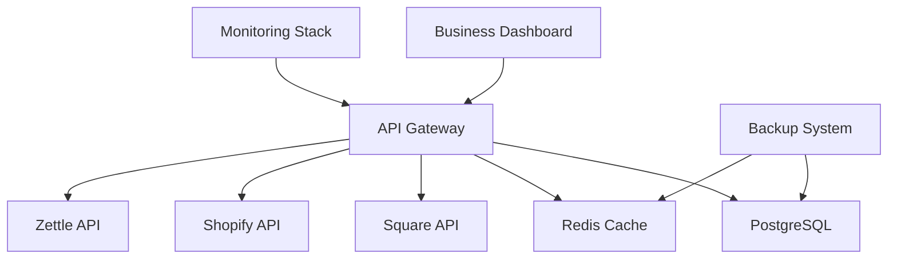

# Production Operations Runbook
## AI Feedback Platform - Swedish Market Deployment

**Version:** 1.0  
**Last Updated:** December 2024  
**Environment:** Swedish Pilot Production  

---

## 📋 Table of Contents

1. [System Overview](#system-overview)
2. [Swedish Business Context](#swedish-business-context)
3. [Architecture & Infrastructure](#architecture--infrastructure)
4. [Monitoring & Alerting](#monitoring--alerting)
5. [Common Incidents & Responses](#common-incidents--responses)
6. [POS Integration Troubleshooting](#pos-integration-troubleshooting)
7. [Performance Optimization](#performance-optimization)
8. [Backup & Recovery Procedures](#backup--recovery-procedures)
9. [Disaster Recovery](#disaster-recovery)
10. [Swedish Business Hours Operations](#swedish-business-hours-operations)
11. [Escalation Procedures](#escalation-procedures)
12. [Maintenance Windows](#maintenance-windows)

---

## System Overview

### Core Components

- **API Gateway:** Node.js/Express application handling POS integrations
- **Business Dashboard:** React/Next.js application for Swedish businesses
- **Database:** PostgreSQL with point-in-time recovery
- **Cache:** Redis for performance optimization
- **Monitoring:** Prometheus, Grafana, AlertManager
- **POS Integrations:** Square, Shopify, Zettle (Swedish market focus)

### Key Metrics to Monitor

```
- Response Time: < 2 seconds (95th percentile)
- Error Rate: < 1% (Swedish business hours)
- POS Connectivity: > 99% uptime
- Database Performance: < 500ms query time
- Cache Hit Rate: > 70%
- Webhook Delivery Success: > 98%
```

---

## Swedish Business Context

### Business Hours (Europe/Stockholm timezone)

- **Weekdays:** 09:00-18:00 CET/CEST
- **Weekends:** 10:00-16:00 CET/CEST  
- **Swedish Holidays:** Reduced monitoring (see config)

### Alert Severity by Time

| Time Period | High Severity | Medium Severity | Low Severity |
|-------------|---------------|-----------------|--------------|
| Business Hours | Immediate | < 30 min | < 2 hours |
| Extended Hours | < 30 min | < 2 hours | < 8 hours |
| Off Hours | < 2 hours | < 8 hours | Next business day |

### Swedish Compliance Requirements

- **GDPR:** Strict data protection, no voice storage
- **Swedish Accounting Standards (K3):** Financial record keeping
- **VAT Requirements:** 25% VAT handling
- **Organization Number Validation:** Format: XXXXXX-XXXX

---

## Architecture & Infrastructure

### Production Environment

```yaml
Infrastructure:
  - Region: EU-West-1 (Stockholm)
  - Backup Region: EU-Central-1
  - Container Platform: Docker/Railway
  - CDN: Vercel Edge Network
  - Database: Supabase PostgreSQL
  - Cache: Redis Cloud
```

### Service Dependencies



### Network Architecture

- **Primary Network:** swedish-pilot-network (172.25.0.0/16)
- **Monitoring Network:** pos-monitoring-network (172.20.0.0/16)
- **Load Balancer:** Nginx with Swedish business hours awareness

---

## Monitoring & Alerting

### Dashboard URLs

- **Main Dashboard:** http://monitoring.ai-feedback.se:3005
- **POS Health:** http://monitoring.ai-feedback.se:3005/d/pos-overview
- **Swedish Business Metrics:** http://monitoring.ai-feedback.se:3005/d/swedish-business
- **Infrastructure:** http://monitoring.ai-feedback.se:9095

### Alert Channels

- **Slack:** #ai-feedback-swedish-alerts
- **Email:** devops@ai-feedback.se
- **SMS:** Critical alerts during business hours
- **PagerDuty:** After-hours critical incidents

### Key Alert Rules

#### Critical Alerts (Immediate Response)

```yaml
POS_PROVIDER_DOWN_BUSINESS_HOURS:
  condition: pos_connection_status == 0 AND business_hours()
  impact: Businesses cannot process feedback
  response_time: < 5 minutes

DATABASE_CONNECTION_LOST:
  condition: database_connections == 0
  impact: Complete service outage
  response_time: < 2 minutes

HIGH_ERROR_RATE_BUSINESS_HOURS:
  condition: error_rate > 5% AND business_hours()
  impact: Customer experience degraded
  response_time: < 10 minutes
```

#### Warning Alerts (Monitor & Plan)

```yaml
SLOW_RESPONSE_TIMES:
  condition: response_time_p95 > 2000ms
  impact: Performance degradation
  response_time: < 30 minutes

WEBHOOK_DELIVERY_FAILURES:
  condition: webhook_failure_rate > 10%
  impact: POS data synchronization issues
  response_time: < 1 hour

CACHE_HIT_RATE_LOW:
  condition: cache_hit_rate < 60%
  impact: Increased load on database
  response_time: < 2 hours
```

---

## Common Incidents & Responses

### 🚨 Service Outage (Complete)

**Symptoms:** All endpoints returning 5xx errors, no successful requests

**Immediate Actions:**
1. Check service health: `curl https://api.ai-feedback.se/health`
2. Verify infrastructure status
3. Check container logs: `docker logs ai-feedback-api`
4. Activate maintenance mode if needed

**Investigation Steps:**
```bash
# Check service status
docker ps | grep ai-feedback

# Check logs
tail -f /var/log/ai-feedback/*.log

# Check resource usage
docker stats

# Check database connectivity
psql $DATABASE_URL -c "SELECT 1"
```

**Resolution:**
1. Restart failed services: `docker-compose restart`
2. Check for recent deployments
3. If database issue, check connection limits
4. Escalate if not resolved in 15 minutes

### 🔌 POS Provider Connection Issues

**Symptoms:** POS health checks failing, webhook delivery failures

**Swedish Business Impact Assessment:**
- During business hours: **CRITICAL** - immediate response
- Off-hours: **MEDIUM** - monitor and fix before next business day
- Holidays: **LOW** - document and address on next business day

**Diagnosis Commands:**
```bash
# Check POS provider health
curl -s "https://api.ai-feedback.se/pos/health/square" | jq
curl -s "https://api.ai-feedback.se/pos/health/shopify" | jq  
curl -s "https://api.ai-feedback.se/pos/health/zettle" | jq

# Check connection pool status
redis-cli -u $REDIS_URL get "pos_pool:square"

# Review recent webhook deliveries
psql $DATABASE_URL -c "
SELECT provider, status, COUNT(*) 
FROM webhook_delivery_attempts 
WHERE created_at > NOW() - INTERVAL '1 hour' 
GROUP BY provider, status
"
```

**Resolution Steps:**
1. **Verify API credentials and quotas**
2. **Test secondary endpoints (failover)**
3. **Check for provider-specific outages**
4. **Trigger manual failover if needed:**
   ```bash
   curl -X POST "https://api.ai-feedback.se/admin/pos/failover" \
     -H "Authorization: Bearer $ADMIN_TOKEN" \
     -d '{"provider": "square", "reason": "primary_endpoint_down"}'
   ```

### 📊 Performance Degradation

**Symptoms:** Slow response times, increased latency, timeouts

**Swedish Business Context:** Performance issues are most critical during peak Swedish business hours (11:00-15:00 CET)

**Immediate Checks:**
```bash
# Check response times
curl -w "@curl-format.txt" -o /dev/null -s "https://api.ai-feedback.se/health"

# Check database performance
psql $DATABASE_URL -c "
SELECT query, mean_time, calls 
FROM pg_stat_statements 
ORDER BY mean_time DESC LIMIT 10
"

# Check cache performance  
redis-cli -u $REDIS_URL --latency -h
```

**Performance Optimization Actions:**
1. **Scale connection pools:** Increase max connections
2. **Clear cache if needed:** `redis-cli -u $REDIS_URL FLUSHDB`
3. **Review database queries:** Check for missing indexes
4. **Enable query optimization:** Use read replicas for reports

### 🔐 Security Incidents

**Symptoms:** Unusual access patterns, authentication failures, suspicious API usage

**Immediate Response:**
1. **Isolate affected systems**
2. **Review access logs**
3. **Check for data exfiltration attempts**
4. **Notify security team and stakeholders**

**GDPR Compliance Steps:**
1. Document incident timeline
2. Assess data exposure risk
3. Prepare regulatory notifications if needed
4. Review Swedish privacy authority requirements

---

## POS Integration Troubleshooting

### Square Integration Issues

**Common Problems:**

1. **Invalid Webhook Signatures**
   ```bash
   # Check webhook signature validation
   grep "Invalid webhook signature" /var/log/ai-feedback/pos-webhooks.log
   
   # Verify webhook endpoint configuration
   curl -X GET "https://connect.squareup.com/v2/webhooks/subscriptions" \
     -H "Authorization: Bearer $SQUARE_ACCESS_TOKEN"
   ```

2. **Rate Limiting**
   ```bash
   # Check rate limit status
   curl -I "https://connect.squareup.com/v2/locations" \
     -H "Authorization: Bearer $SQUARE_ACCESS_TOKEN"
   
   # Look for X-RateLimit headers
   ```

3. **OAuth Token Expiration**
   ```bash
   # Test token validity
   curl "https://connect.squareup.com/v2/merchants" \
     -H "Authorization: Bearer $SQUARE_ACCESS_TOKEN"
   
   # Refresh token if needed
   curl -X POST "https://connect.squareup.com/oauth2/token" \
     -d "client_id=$SQUARE_CLIENT_ID&grant_type=refresh_token&refresh_token=$REFRESH_TOKEN"
   ```

### Shopify Integration Issues

**Common Problems:**

1. **Webhook Verification Failures**
   ```bash
   # Check HMAC verification
   grep "Shopify HMAC" /var/log/ai-feedback/pos-webhooks.log
   
   # Verify webhook configuration
   curl -X GET "https://$SHOP_DOMAIN.myshopify.com/admin/api/2023-10/webhooks.json" \
     -H "X-Shopify-Access-Token: $SHOPIFY_ACCESS_TOKEN"
   ```

2. **API Version Compatibility**
   ```bash
   # Check API version compatibility
   curl "https://$SHOP_DOMAIN.myshopify.com/admin/api/2023-10/shop.json" \
     -H "X-Shopify-Access-Token: $SHOPIFY_ACCESS_TOKEN"
   ```

### Zettle Integration Issues

**Common Problems:**

1. **OAuth Flow Issues**
   ```bash
   # Test OAuth token
   curl "https://oauth.izettle.com/users/me" \
     -H "Authorization: Bearer $ZETTLE_ACCESS_TOKEN"
   
   # Check token expiration
   echo $ZETTLE_ACCESS_TOKEN | base64 -d | jq .exp
   ```

2. **Webhook Delivery Problems**
   ```bash
   # Check webhook subscription status
   curl "https://pusher.izettle.com/organizations/$ORG_UUID/subscriptions" \
     -H "Authorization: Bearer $ZETTLE_ACCESS_TOKEN"
   ```

---

## Performance Optimization

### Database Optimization

**Query Performance:**
```sql
-- Find slow queries
SELECT query, mean_time, calls, total_time
FROM pg_stat_statements 
WHERE mean_time > 1000 -- queries taking > 1 second
ORDER BY mean_time DESC;

-- Check index usage
SELECT schemaname, tablename, indexname, idx_tup_read, idx_tup_fetch
FROM pg_stat_user_indexes 
ORDER BY idx_tup_read DESC;

-- Connection pool status
SELECT state, COUNT(*) 
FROM pg_stat_activity 
GROUP BY state;
```

**Optimization Actions:**
```bash
# Restart database connections
docker restart ai-feedback-api

# Clear query cache
psql $DATABASE_URL -c "SELECT pg_stat_reset()"

# Update table statistics
psql $DATABASE_URL -c "ANALYZE"
```

### Cache Optimization

**Redis Performance Tuning:**
```bash
# Check memory usage
redis-cli -u $REDIS_URL info memory

# Monitor slow queries
redis-cli -u $REDIS_URL slowlog get 10

# Check hit rate
redis-cli -u $REDIS_URL info stats | grep keyspace

# Optimize cache keys
redis-cli -u $REDIS_URL --bigkeys
```

### POS API Optimization

**Connection Pool Tuning:**
```bash
# Check current pool settings
curl -s "https://api.ai-feedback.se/admin/pos/pools" | jq

# Optimize pool sizes based on load
curl -X POST "https://api.ai-feedback.se/admin/pos/pools/optimize" \
  -H "Authorization: Bearer $ADMIN_TOKEN"

# Monitor request batching efficiency
grep "batch_utilization" /var/log/ai-feedback/pos-performance.log
```

---

## Backup & Recovery Procedures

### Daily Backup Checklist

**Automated Backups:**
- ✅ Database: Full backup daily at 02:00 CET
- ✅ Redis: Snapshot every 6 hours
- ✅ POS Configuration: Daily backup at 03:00 CET
- ✅ Application Config: Daily backup at 04:00 CET

**Manual Verification:**
```bash
# Check backup status
/opt/ai-feedback/scripts/comprehensive-backup-system.sh report

# Verify recent backups
aws s3 ls s3://$BACKUP_S3_BUCKET/database/daily/ --human-readable

# Test backup integrity
/opt/ai-feedback/scripts/comprehensive-backup-system.sh verify [backup_id]
```

### Recovery Procedures

**Database Recovery:**
```bash
# List available backups
psql $DATABASE_URL -c "
SELECT backup_id, created_at, file_size 
FROM backup_records 
WHERE backup_type = 'database' AND status = 'completed' 
ORDER BY created_at DESC LIMIT 10
"

# Restore specific backup
/opt/ai-feedback/scripts/comprehensive-backup-system.sh restore [backup_id]

# Point-in-time recovery
/opt/ai-feedback/scripts/comprehensive-backup-system.sh pitr "2024-12-01 14:30:00"
```

**Redis Recovery:**
```bash
# Stop Redis service
docker stop redis-container

# Restore from backup
docker run --rm -v redis-data:/data -v /backup/redis:/backup \
  redis:alpine cp /backup/dump.rdb /data/

# Start Redis service
docker start redis-container
```

### Backup Monitoring

**Health Checks:**
```bash
# Check backup completion
grep "SUCCESS.*backup completed" /var/log/ai-feedback/backup-system.log

# Verify S3 replication
aws s3 ls s3://$BACKUP_S3_BUCKET-stockholm/
aws s3 ls s3://$BACKUP_S3_BUCKET-gothenburg/

# Check backup encryption
aws s3api head-object --bucket $BACKUP_S3_BUCKET --key database/daily/[filename] | grep ServerSideEncryption
```

---

## Disaster Recovery

### Disaster Scenarios & Response

#### Scenario 1: Complete Database Loss

**Recovery Time Objective (RTO):** 30 minutes  
**Recovery Point Objective (RPO):** 1 hour  

**Response Plan:**
1. **Immediate:** Activate maintenance mode
2. **Assessment:** Determine extent of data loss
3. **Recovery:** Restore latest backup
4. **Validation:** Verify data integrity
5. **Resume:** Disable maintenance mode

**Commands:**
```bash
# Activate maintenance mode
curl -X POST "https://api.ai-feedback.se/admin/maintenance" \
  -H "Authorization: Bearer $ADMIN_TOKEN" \
  -d '{"reason": "database_recovery", "estimated_duration": "30min"}'

# Execute recovery plan
/opt/ai-feedback/scripts/pos-disaster-recovery.sh execute pos_database_failure

# Validate recovery
/opt/ai-feedback/scripts/comprehensive-backup-system.sh test
```

#### Scenario 2: All POS Providers Down

**Impact:** Swedish businesses cannot collect feedback  
**RTO:** 10 minutes  
**RPO:** 5 minutes  

**Response Plan:**
1. **Verify:** Confirm all providers are affected
2. **Failover:** Switch to secondary endpoints
3. **Escalate:** Contact POS provider support
4. **Communicate:** Notify affected businesses

#### Scenario 3: Regional Infrastructure Failure

**RTO:** 60 minutes  
**RPO:** 15 minutes  

**Response Plan:**
1. **Activate:** Backup region (EU-Central-1)
2. **DNS:** Update to backup region
3. **Data:** Sync latest backups
4. **Monitor:** Verify service restoration

### Failover Procedures

**Manual Failover:**
```bash
# Trigger regional failover
curl -X POST "https://api.ai-feedback.se/admin/disaster-recovery/failover" \
  -H "Authorization: Bearer $ADMIN_TOKEN" \
  -d '{
    "type": "regional",
    "target_region": "eu-central-1",
    "reason": "primary_region_failure"
  }'

# Monitor failover progress
curl -s "https://api.ai-feedback.se/admin/disaster-recovery/status" | jq
```

**Automated Failover Triggers:**
- Primary region unavailable > 5 minutes
- Database connection failures > 3 consecutive
- Error rate > 50% for > 2 minutes during business hours

---

## Swedish Business Hours Operations

### Business Hours Support Schedule

**Peak Hours (11:00-15:00 CET):**
- DevOps engineer on standby
- Maximum 2-minute response time for critical alerts
- All monitoring systems active
- Performance optimization focus

**Standard Hours (09:00-18:00 CET weekdays):**
- Standard monitoring active
- 5-minute response time for critical alerts
- Regular health checks every 30 seconds

**Extended Hours (18:00-22:00 CET):**
- Reduced monitoring frequency
- 15-minute response time for critical alerts
- Automated recovery attempts before escalation

**Off-Hours (22:00-09:00 CET, weekends, holidays):**
- Minimal monitoring
- Critical alerts only
- 30-minute response time
- Automated systems handle routine issues

### Holiday Operations

**Swedish Public Holidays:**
```yaml
2024_Holidays:
  - "2024-01-01": "Nyårsdagen (New Year)"
  - "2024-01-06": "Trettondedag jul (Epiphany)"
  - "2024-03-29": "Långfredagen (Good Friday)"
  - "2024-04-01": "Annandag påsk (Easter Monday)"
  - "2024-05-01": "Första maj (Labour Day)"
  - "2024-05-09": "Kristi himmelfärds dag (Ascension)"
  - "2024-06-06": "Sveriges nationaldag (National Day)"
  - "2024-06-21": "Midsommarafton (Midsummer Eve)"
  - "2024-06-22": "Midsommardagen (Midsummer Day)"
  - "2024-12-24": "Julafton (Christmas Eve)"
  - "2024-12-25": "Juldagen (Christmas Day)"
  - "2024-12-26": "Annandag jul (Boxing Day)"
  - "2024-12-31": "Nyårsafton (New Year's Eve)"
```

**Holiday Monitoring:**
- Alerts reduced to critical only
- Extended response times
- No planned maintenance
- Emergency contact available

---

## Escalation Procedures

### Escalation Matrix

| Severity | Business Hours | Extended Hours | Off Hours |
|----------|----------------|----------------|-----------|
| **Critical** | DevOps → Engineering Lead → CTO | DevOps → On-call Engineer | On-call → Engineering Lead |
| **High** | DevOps → Team Lead | DevOps → Team Lead (next day) | Document → Team Lead |
| **Medium** | Team Discussion | Next Business Day | Next Business Day |
| **Low** | Ticket Creation | Ticket Creation | Ticket Creation |

### Contact Information

```yaml
Primary Contacts:
  DevOps_Engineer:
    name: "DevOps Team"
    phone: "+46-xxx-xxx-xxxx"
    email: "devops@ai-feedback.se"
    slack: "@devops-team"
    
  Engineering_Lead:
    name: "Engineering Lead"
    phone: "+46-xxx-xxx-xxxx"
    email: "engineering@ai-feedback.se"
    slack: "@eng-lead"
    
  CTO:
    name: "Chief Technology Officer"
    phone: "+46-xxx-xxx-xxxx"
    email: "cto@ai-feedback.se"
    
External Contacts:
  Railway_Support:
    url: "https://railway.app/support"
    priority: "Critical infrastructure issues"
    
  Supabase_Support:
    email: "support@supabase.com"
    priority: "Database issues"
    
  Redis_Cloud_Support:
    url: "https://redislabs.com/support"
    priority: "Cache/performance issues"
```

### Escalation Triggers

**Immediate Escalation:**
- Complete service outage > 5 minutes
- Data loss or corruption detected
- Security breach suspected
- GDPR violation potential

**Scheduled Escalation:**
- High error rates not resolved in 30 minutes
- Performance degradation > 1 hour
- POS integration failures affecting > 25% of businesses

---

## Maintenance Windows

### Scheduled Maintenance

**Regular Maintenance Windows:**
- **Weekly:** Sundays 06:00-08:00 CET (low impact)
- **Monthly:** First Sunday 04:00-10:00 CET (system updates)
- **Quarterly:** Database maintenance and optimization

**Emergency Maintenance:**
- Can be scheduled with 2-hour notice during off-hours
- Requires business justification during business hours
- Maximum 1-hour duration unless approved by Engineering Lead

### Maintenance Procedures

**Pre-Maintenance Checklist:**
```bash
# 1. Verify backup status
/opt/ai-feedback/scripts/comprehensive-backup-system.sh report

# 2. Check system health
curl -s "https://api.ai-feedback.se/health" | jq

# 3. Review ongoing incidents
grep "CRITICAL\|ERROR" /var/log/ai-feedback/*.log | tail -20

# 4. Notify stakeholders
curl -X POST $SLACK_WEBHOOK -d '{"text":"Maintenance starting in 30 minutes"}'

# 5. Enable maintenance mode
curl -X POST "https://api.ai-feedback.se/admin/maintenance" \
  -H "Authorization: Bearer $ADMIN_TOKEN"
```

**Post-Maintenance Validation:**
```bash
# 1. Health checks
curl -s "https://api.ai-feedback.se/health" | jq '.status'

# 2. POS integrations
for provider in square shopify zettle; do
  curl -s "https://api.ai-feedback.se/pos/health/$provider" | jq '.healthy'
done

# 3. Performance validation
curl -w "%{time_total}" -o /dev/null -s "https://api.ai-feedback.se/health"

# 4. Database connectivity
psql $DATABASE_URL -c "SELECT COUNT(*) FROM businesses"

# 5. Disable maintenance mode
curl -X DELETE "https://api.ai-feedback.se/admin/maintenance" \
  -H "Authorization: Bearer $ADMIN_TOKEN"
```

---

## Appendices

### A. Emergency Commands Quick Reference

```bash
# Service status
docker ps | grep ai-feedback
systemctl status ai-feedback-*

# Restart services
docker-compose restart
systemctl restart ai-feedback-api

# Check logs
tail -f /var/log/ai-feedback/*.log
docker logs -f ai-feedback-api

# Database emergency
psql $DATABASE_URL -c "SELECT pg_terminate_backend(pid) FROM pg_stat_activity WHERE state = 'idle in transaction'"

# Cache emergency
redis-cli -u $REDIS_URL FLUSHALL

# Enable/disable maintenance
curl -X POST/DELETE "https://api.ai-feedback.se/admin/maintenance"
```

### B. Swedish Language Common Terms

- **Företag:** Business/Company
- **Organisationsnummer:** Organization Number
- **Moms:** VAT (Value Added Tax)
- **Kassasystem:** POS System/Cash Register
- **Återkoppling:** Feedback
- **Prestanda:** Performance
- **Övervakning:** Monitoring
- **Säkerhetskopiering:** Backup

### C. Compliance & Legal Requirements

- **GDPR Article 33:** Data breach notification within 72 hours
- **Swedish Data Protection Authority:** Dataskyddsombudsmannen
- **Financial Records Retention:** 7 years (Swedish law)
- **VAT Record Requirements:** Monthly reporting to Skatteverket

---

**Document Control:**
- **Owner:** DevOps Team
- **Reviewers:** Engineering Lead, Security Team
- **Next Review:** Quarterly
- **Distribution:** All technical team members

**Emergency Contact:** +46-xxx-xxx-xxxx (24/7 critical issues only)